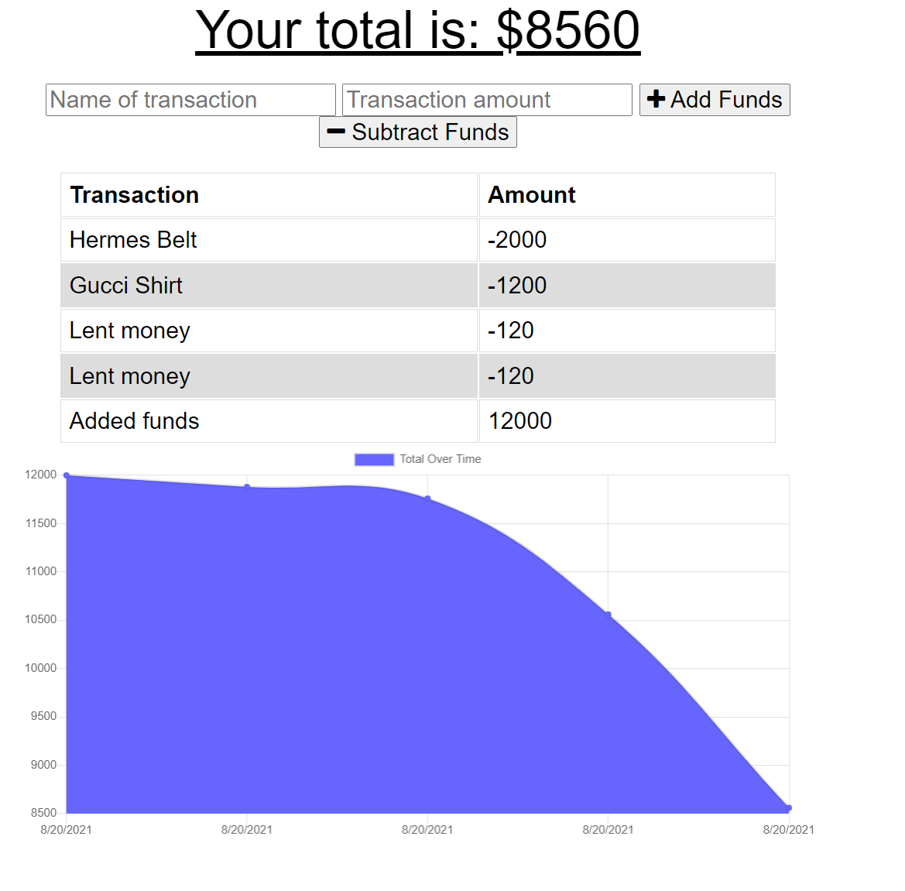

# budget tracker  
A budget Tracker application to allow for offline access and functionality. When entering transactions offline, they will populate the total when brought back online.

## Live Demo
[Click to go to live URL](https://still-bayou-73273.herokuapp.com/)

## App Image View


## Table of Contents:
* [Installation](#installation)
* [Usage](#usage)
* [License](#license)
* [Contributing](#contributing)
* [Tests](#tests)
* [Questions](#questions)

### Installation:
To install dependencies, run the following:
```npm i```

### Usage:
clone down application and run np i, then run application with either nodemon or node server.js

### License:
This project is licensed under:
MIT

### Contributing:
Fork down application, make desire changes and then upload with a well documented description.

### Tests:
To run the test enter the following:
```npm run test```

### Questions:
If you have any questions contact me at [GitHub](https://github.com/julioPlaceres) or contact me at jplaceresvaldes@outlook.com
    
 